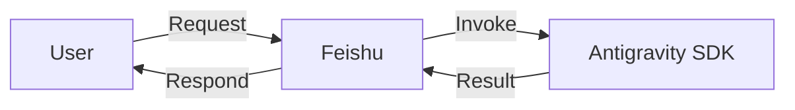

# AGENTS.md

这是一个利用飞书机器人和Antigravity SDK构建的一个私人AI助手。

## 核心功能

### 命令行模式
- 用户可以通过命令行进行消息的发送

### 服务监听模式
- 监听消息然后调用Agent生成回复后再转发给用户

## 开发工具

- 请使用`uv`进行python包管理。
- `uv run pytest`进行测试。

## 编码规范

- **导入风格**：包内部模块间引用（`src/feishu_bot_cli_antigravity` 内部各模块及 `__init__.py`）统一使用显式相对导入（如 `from . import __version__`、`from .channel import FeishuBotChannel`），避免在包内使用绝对导入。

## 目录结构

- `src\feishu_bot_cli_antigravity`
  - `cli.py`：工具入口，参数解析以及启动服务
  - `channel.py`：飞书消息监听和发送逻辑
  - `agent.py`：Antigravity Agent逻辑
  - `config.py`：配置
  - `utils.py`：工具类
- `tests`
  - `test_*.py`：测试文件
- `skills\feishu-bot-cli-antigravity`
  - 本工具配套的SKILL文档