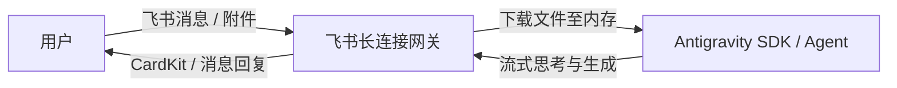

# Feishu Bot Cli Antigravity

基于 Google Antigravity SDK 和飞书开放平台构建的私人 AI 助手机器人命令行工具。

## 架构



## 功能特点

- **服务监听模式 (`listen`)**：
  - 基于长连接 (WebSocket) 监听飞书群聊与私聊消息。
  - 自动将接收到的图片、代码、PDF、文本等多媒体附件**直接下载至内存**，以原生多模态对象传递给 Agent。
  - 支持会话级消息排队锁 (`asyncio.Lock`) 与 `AsyncExitStack` 上下文生命周期管理。
  - 支持 CardKit 流式打字机卡片回复与普通消息兜底。
  - 支持可选的 `--chat-id` 过滤，仅服务指定会话。
- **命令行模式 (`send`)**：
  - 命令行主动向指定会话发送消息或文件。
  - `--chat-id` 为**必须参数**。
  - 支持发送文本、Markdown 格式消息或本地文件/图片。

## 环境配置

在项目根目录下配置 `.env` 文件：

```env
LARK_APP_ID=cli_xxxxxxxxxxxxxx
LARK_APP_SECRET=xxxxxxxxxxxxxxxxxxxxxxxxxxxxxxxx
GEMINI_API_KEY=xxxxxxxxxxxxxxxxxxxxxxxxxxxxxxxxx
LOG_LEVEL=INFO
```

## 命令行使用

### 1. 监听服务

启动长连接监听消息并自动调用 Agent 回复：

```bash
# 监听所有会话
uv run feishu-bot listen

# 仅监听并响应指定 chat_id 的消息
uv run feishu-bot listen --chat-id <oc_xxxxxxxxxxxx>
```

### 2. 主动发送消息

命令行主动向指定会话发送消息：

```bash
# 发送 Markdown 消息（--chat-id 为必填项）
uv run feishu-bot send --chat-id <oc_xxxxxxxxxxxx> --message "**你好！** 这是一条来自 CLI 的消息"

# 发送纯文本消息
uv run feishu-bot send --chat-id <oc_xxxxxxxxxxxx> -m "纯文本消息" --type text

# 发送本地文件或图片（支持同时指定多个文件及附带文本说明）
uv run feishu-bot send --chat-id <oc_xxxxxxxxxxxx> --file "./report.pdf" "./chart.png" -m "请查收本期分析报告"

# 从标准输入读取长文本/大段 Markdown（管道传输）
cat report.md | uv run feishu-bot send --chat-id <oc_xxxxxxxxxxxx> --stdin
# 或使用 -m -
cat report.md | uv run feishu-bot send --chat-id <oc_xxxxxxxxxxxx> -m -

# 交互式终端输入长文本（按 Ctrl+Z 回车或 Ctrl+D 结束输入）
uv run feishu-bot send --chat-id <oc_xxxxxxxxxxxx> --stdin
```

## 测试与代码检查

```bash
# 运行测试
uv run pytest

# 运行代码规范检查
uv run ruff check
```
