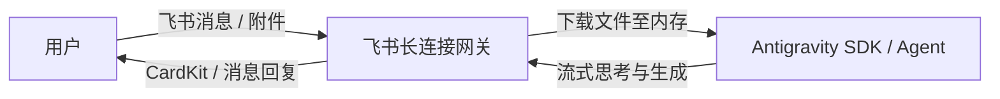

# Feishu Bot CLI Antigravity

基于 Google Antigravity SDK 和飞书开放平台构建的私人 AI 助手机器人命令行工具。

## 架构



## 功能特点

- **服务监听模式 (`listen`)**：
  - 基于长连接 (WebSocket) 监听飞书群聊与私聊消息。
  - 自动将接收到的图片、代码、PDF、文本等多媒体附件**直接下载至内存**，以原生多模态对象传递给 Agent。
  - 支持会话级消息排队锁 (`asyncio.Lock`) 与 `AsyncExitStack` 上下文生命周期管理。
  - 支持 CardKit 流式打字机卡片回复与普通消息兜底。
  - 支持可选的 `--chat-id` 过滤，仅服务指定会话。
- **命令行模式 (`send`)**：
  - 命令行主动向指定会话发送消息或文件。
  - `--chat-id` 为**必须参数**。
  - 支持发送文本、Markdown 格式消息或本地文件/图片。

## 环境配置

在项目根目录下配置 `.env` 文件：

```env
LARK_APP_ID=cli_xxxxxxxxxxxxxx
LARK_APP_SECRET=xxxxxxxxxxxxxxxxxxxxxxxxxxxxxxxx
GEMINI_API_KEY=xxxxxxxxxxxxxxxxxxxxxxxxxxxxxxxxx
LOG_LEVEL=INFO
```

`LARK_APP_ID`和`LARK_APP_SECRET`在[飞书开放平台](https://open.feishu.cn)创建机器人后获取，注意机器人需要添加消息权限以及事件监听。

## 命令行使用

### 1. 监听服务

启动长连接监听消息并自动调用 Agent 回复：

```bash
# 监听所有会话（默认使用当前路径）
uvx feishu-bot-cli-antigravity listen

# 指定工作目录（影响 .env、mcp、skills 与 AGENTS.md 的加载）
uvx feishu-bot-cli-antigravity listen --work-dir /path/to/workspace
# 或使用简写 -w
uvx feishu-bot-cli-antigravity listen -w /path/to/workspace

# 仅监听并响应指定 chat_id 的消息
uvx feishu-bot-cli-antigravity listen --chat-id <oc_xxxxxxxxxxxx>
```

### 2. 主动发送消息

命令行主动向指定会话发送消息：

```bash
# 发送 Markdown 消息（--chat-id 为必填项）
uvx feishu-bot-cli-antigravity send --chat-id <oc_xxxxxxxxxxxx> --message "**你好！** 这是一条来自 CLI 的消息"

# 发送纯文本消息
uvx feishu-bot-cli-antigravity send --chat-id <oc_xxxxxxxxxxxx> -m "纯文本消息" --type text

# 发送本地文件或图片（支持同时指定多个文件及附带文本说明）
uvx feishu-bot-cli-antigravity send --chat-id <oc_xxxxxxxxxxxx> --file "./report.pdf" "./chart.png" -m "请查收本期分析报告"

# 从标准输入读取长文本/大段 Markdown（管道传输）
cat report.md | uvx feishu-bot-cli-antigravity send --chat-id <oc_xxxxxxxxxxxx> --stdin
# 或使用 -m -
cat report.md | uvx feishu-bot-cli-antigravity send --chat-id <oc_xxxxxxxxxxxx> -m -

# 交互式终端输入长文本（按 Ctrl+Z 回车或 Ctrl+D 结束输入）
uvx feishu-bot-cli-antigravity send --chat-id <oc_xxxxxxxxxxxx> --stdin
```

## 工作目录 (`work-dir`)

在运行 `listen` 监听服务时，可以通过 `--work-dir` / `-w` 参数显式指定 Agent 运行的工作目录（若未指定，默认使用执行命令时的当前路径）：

```bash
uvx feishu-bot-cli-antigravity listen --work-dir /path/to/workspace
# 或使用简写 -w
uvx feishu-bot-cli-antigravity listen -w /path/to/workspace
```

指定的工作目录会作为 Antigravity SDK 的底层工作区（`workspaces`），统一控制以下资源的检索与加载位置：

1. **`.env`（环境变量配置）**：若指定了工作目录且该目录下存在 `.env` 文件，优先加载该工作目录下的 `.env`（未指定时默认从当前终端执行命令所在目录查找）。
2. **`AGENTS.md`（行为指令与规则）**：自动读取工作目录根路径下的 `AGENTS.md` 文件，作为该 Agent 的工作区指令与业务规则约束。
3. **Agent Skills（技能工具扩展）**：自动将工作目录下的 `.agents/skills` 目录作为技能根路径，检索并注入符合规范的自定义技能包。
4. **MCP 配置文件**：默认寻找工作目录下的 `.agents/mcp_config.json` 文件以接入 MCP 服务工具。

### MCP (Model Context Protocol) 支持

本工具支持通过 MCP 为 Agent 接入外部工具：
- 默认自动检测并加载当前工作目录下的 `.agents/mcp_config.json` 配置文件；若不存在则跳过加载，正常启动。
- 支持 `stdio`（本地可执行程序/脚本）与 `http`/`sse`（远程流式服务）两种传输模式。
- 支持在配置中使用 `${VAR}` 语法自动展开系统环境变量。

#### `.agents/mcp_config.json` 配置示例

```json
{
  "mcpServers": {
    "fetch": {
      "command": "uvx",
      "args": ["mcp-server-fetch"]
    },
    "filesystem": {
      "command": "npx",
      "args": ["-y", "@modelcontextprotocol/server-filesystem", "./data"]
    },
    "remote-service": {
      "serverUrl": "https://mcp.example.com/sse",
      "headers": {
        "Authorization": "Bearer ${MCP_TOKEN}"
      }
    }
  }
}
```

## 测试与代码检查

```bash
# 运行测试
uv run pytest

# 运行代码规范检查
uv run ruff check
```
